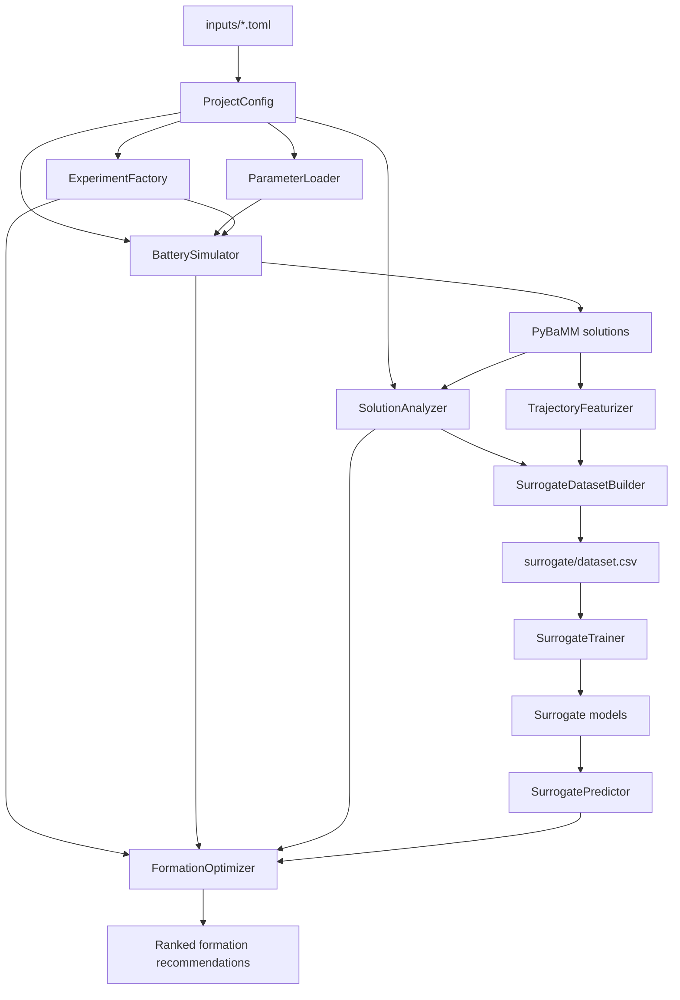

# Battery Formation Recommendation

This project evaluates lithium-ion battery formation protocols with PyBaMM,
trains surrogate ageing models, and ranks formation choices with multi-criteria
optimization (MCO).

The codebase is organized so that configuration, electrochemical simulation,
surrogate modelling, and recommendation logic can be changed independently.
Runtime values belong in TOML files under `inputs/`; Python classes implement
the behavior that consumes those values.

## Project Layout

```text
Surrogate_modelling_2/
├── inputs/
│   ├── config.py
│   ├── parameters.toml
│   ├── simulation.toml
│   ├── mco.toml
│   └── surrogate.toml
├── simulations/
│   ├── parameters.py
│   ├── experiments.py
│   ├── runner.py
│   ├── analysis.py
│   └── plotting.py
├── surrogate/
│   ├── features.py
│   ├── dataset.py
│   ├── training.py
│   ├── predictor.py
│   ├── create_dataset.py
│   └── train_models.py
├── mco/
│   └── optimizer.py
├── run_simulation.py
└── run_recommendation.py
```

Generated artifacts remain next to the functionality that owns them:

```text
surrogate/dataset.csv
surrogate/failed_candidates.csv
surrogate/models/
surrogate/plots/
mco/results/
plots/
```

These generated paths are ignored by Git.

## System Flow



## Installation

Activate the existing virtual environment:

```bash
source .venv/bin/activate
```

Install dependencies when required:

```bash
python3 -m pip install -r requirements.txt
```

XGBoost requires an OpenMP runtime. On macOS with Homebrew:

```bash
brew install libomp
```

Installing the Python `xgboost` package alone is insufficient when
`libomp.dylib` is unavailable.

Run commands from the project root. Package commands should use `-m`:

```bash
python3 -m surrogate.create_dataset
python3 -m surrogate.train_models
```

## Input Configuration

### `inputs/parameters.toml`

Contains the complete PyBaMM parameter set. It currently starts from the
Mohtat2020 values and includes project-specific overrides.

Each entry has a name, type, and value:

```toml
[[parameter]]
name = "Negative electrode reaction-driven LAM factor [m3.mol-1]"
type = "float"
value = 1e-4
```

Function-valued PyBaMM parameters use an import reference:

```toml
type = "function"
value = "pybamm.input.parameters.lithium_ion.Mohtat2020:function_name"
```

Modify this file when changing:

- Cell geometry or nominal capacity.
- Electrode or electrolyte properties.
- SEI, plating, thermal, or LAM coefficients.
- Initial concentrations or temperatures.
- Project-specific PyBaMM parameter overrides.

`ParameterLoader` in `simulations/parameters.py` converts these typed TOML
entries into `pybamm.ParameterValues`.

### `inputs/simulation.toml`

Owns all settings for an individual PyBaMM simulation.

#### `[solver]`

Controls IDAKLU tolerances:

```toml
[solver]
relative_tolerance = 1e-6
absolute_tolerance = 1e-6
```

#### `[model.options]`

Passed directly to `pybamm.lithium_ion.DFN`. This section selects SEI,
plating, thermal, porosity, and LAM submodels.

Modify this section when enabling or disabling a degradation mechanism. New
mechanisms may require additional entries in `parameters.toml`.

#### `[experiments]`

Defines the fixed pre-step and ageing cycle as PyBaMM experiment strings.

```toml
[experiments]
pre_step = ["...", "..."]
aging = ["Charge ...", "Discharge ..."]
```

The pre-step is run once before formation. The ageing cycle is repeated by
`run_simulation.py`, MCO, and surrogate dataset creation.

#### `[formation]`

Defines fixed voltage cutoffs and the default formation choice:

```toml
[formation]
charge_voltage = 4.1
discharge_voltage = 2.7
default_charge_rate = 0.01
default_discharge_rate = 0.01
default_rest_minutes = 0.1
default_cycles = 3
```

`run_simulation.py` uses these default values. MCO and surrogate dataset
creation use their own grids but share these voltage cutoffs.

#### `[capacity_check]`

Configures the low-rate diagnostic charge/discharge used to measure practical
capacity and ECM resistance after formation and ageing.

#### `[run]`

Controls the ageing-cycle count and output plot directory for
`run_simulation.py`.

#### `[[outputs]]`

Defines the tracked ageing metrics. `aggregation = "discharge_step"` measures
capacity across the discharge step. `aggregation = "end"` compares values at
the same end-of-cycle point.

Adding an output here automatically makes it available to `SolutionAnalyzer`
and `ResultPlotter`. The four keys used by MCO and the surrogate are currently:

```text
capacity
plating
sei
resistance
```

#### `[[diagnostics]]`

Defines physical-state checks and acceptable ranges. Values outside their
configured range are reported as warnings.

### `inputs/surrogate.toml`

Controls surrogate dataset creation, feature engineering, training, and plots.

#### `[paths]`

Defines the dataset, failure log, models, and plots. The default dataset path
is `surrogate/dataset.csv`.

#### `[data]`

- `aging_cycles`: PyBaMM cycles used to generate training targets.
- `training_ageing_mesh`: cycle numbers stored as target points.
- `trajectory_feature_count`: uniformly sampled points retained for each
  formation signal.

With 256 points and three signals, the model receives 768 formation features
plus the requested ageing cycle.

#### `[signals]`

Maps measurable formation signals to PyBaMM variable names:

```text
time
terminal voltage
current
```

The featurizer also derives signed and absolute cumulative charge.

#### `[grid]`

Defines formation protocols used to generate the surrogate training dataset.
This grid is independent from the recommendation grid in `mco.toml`.

#### `[xgboost]`

Configures each `XGBRegressor`, including tree depth, learning rate, row/column
sampling, regularization, and histogram tree construction. One independent
model is trained for capacity, plating, SEI, and resistance.

#### `[split]`

Controls grouped train/validation/test splitting. Splits are grouped by
formation protocol so rows from one trajectory do not leak into multiple
sets.

#### `[plots]`

Controls surrogate validation plots. `max_test_protocols = 3` limits each plot
to three protocols. PyBaMM values use solid lines/circles and surrogate values
use dashed lines/x markers.

### `inputs/mco.toml`

Controls formation exploration and ranking.

#### `[recommendation]`

- `mode = "auto"`: use trained surrogate models when available, otherwise run
  PyBaMM ageing.
- `mode = "surrogate"`: require trained surrogate models.
- `mode = "pybamm"`: always run full PyBaMM ageing.
- `top_n`: number of recommendations to retain.
- `aging_cycles`: full ageing length for PyBaMM mode.
- `prediction_cycles`: surrogate cycle points used for start/final ranking.
- `results_dir`: destination for ranked CSV files.

#### `[grid]`

Defines formation candidates explored by MCO:

```text
x1_charge_rate
x2_discharge_rate
x3_rest_minutes
x4_num_cycles
```

#### `[weights]`

Controls the normalized MCO penalty score. Lower scores are better. Formation
time, capacity, capacity fade, plating growth, SEI growth, and resistance
growth can be weighted independently.

## Simulation Classes

### `TomlConfig` and `ProjectConfig`

Location: `inputs/config.py`

- `TomlConfig` reads one TOML file.
- `ProjectConfig` loads all project TOMLs and resolves relative artifact paths
  from the project root.

### `ParameterLoader`

Location: `simulations/parameters.py`

Converts `inputs/parameters.toml` into `pybamm.ParameterValues`, including
numeric, string, list, and importable function values.

### `FormationCandidate` and `ExperimentFactory`

Location: `simulations/experiments.py`

- `FormationCandidate` stores charge rate, discharge rate, rest duration, and
  formation-cycle count.
- `ExperimentFactory` constructs pre-step, formation, ageing, and C/20 capacity
  check experiments from `simulation.toml`.

### `BatterySimulator`

Location: `simulations/runner.py`

Builds the DFN model and IDAKLU solver from TOML, runs PyBaMM experiments, and
supports chaining with `starting_solution`. It does not define experiments or
interpret results.

### `SolutionAnalyzer`

Location: `simulations/analysis.py`

- Removes PyBaMM's zero-duration carry-over cycle.
- Extracts discharge-step capacity correctly.
- Extracts degradation metrics at consistent cycle endpoints.
- Calculates C/20 capacity and resistance.
- Builds result and physical-diagnostic tables.

### `ResultPlotter`

Location: `simulations/plotting.py`

Plots every configured `[[outputs]]` trajectory and saves it under the
configured plot directory.

## Surrogate Classes

### `TrajectoryFeaturizer`

Location: `surrogate/features.py`

Extracts formation voltage/current trajectories, derives signed cumulative
charge, and uniformly samples each signal in time to produce fixed-size input
vectors. No pooling is applied.

Pre-step data is not used as a surrogate feature because the pre-step is fixed,
but it is still simulated to establish the correct state before formation.

### `SurrogateDatasetBuilder`

Location: `surrogate/dataset.py`

For every formation protocol in the surrogate grid:

1. Runs the shared pre-step state.
2. Runs formation.
3. Extracts formation trajectory features.
4. Runs PyBaMM ageing.
5. Records configured ageing-mesh targets.
6. Writes `surrogate/dataset.csv`.

If the dataset already exists, creation is skipped unless `--force` is used.
Failed protocols are written separately.

### `SurrogateTrainer`

Location: `surrogate/training.py`

Loads the existing dataset, performs grouped splits, and trains four pipelines:

```text
SimpleImputer -> StandardScaler -> XGBRegressor
```

It saves models, metadata, metrics, predictions, and validation plots.

### `SurrogatePredictor`

Location: `surrogate/predictor.py`

Loads trained model artifacts lazily and predicts all four ageing metrics for
requested cycle numbers from one formation-feature vector.

## MCO Classes

Location: `mco/optimizer.py`

### `CandidateGrid`

Creates the Cartesian product of formation values in `mco.toml`.

### `CandidateScorer`

Min-max normalizes each objective and combines penalties using configured
weights. Final capacity is treated as higher-is-better; all other objectives
are lower-is-better.

### `ResultRepository`

Writes all candidates, top candidates, and failed candidates into `mco/results/`.

### `FormationOptimizer`

Coordinates the recommendation workflow:

1. Runs the fixed pre-step once.
2. Runs formation for each candidate.
3. Uses surrogate prediction or full PyBaMM ageing.
4. Computes degradation metrics.
5. Scores and ranks candidates.
6. Saves and prints the top recommendations.

## Entry Points

### Create a surrogate dataset

```bash
python3 -m surrogate.create_dataset
```

The existing dataset is reused automatically. To regenerate it:

```bash
python3 -m surrogate.create_dataset --force
```

For a quick pipeline test:

```bash
python3 -m surrogate.create_dataset --force --limit-candidates 2
```

### Train surrogate models

```bash
python3 -m surrogate.train_models
```

This command never creates PyBaMM data. It requires an existing
`surrogate/dataset.csv`.

### Run one individual simulation

```bash
python3 run_simulation.py
```

`IndividualSimulationRunner` uses the default formation choice and ageing
length from `simulation.toml`. Use this after MCO recommends a protocol: update
the `[formation]` defaults, then run the detailed simulation and diagnostics.

### Run formation recommendations

```bash
python3 run_recommendation.py
```

`RecommendationRunner` assembles configuration, simulation, surrogate, and MCO
classes. It writes ranked results under `mco/results/`.

## What Should I Modify?

| Goal | Modify |
|---|---|
| Change cell or degradation parameters | `inputs/parameters.toml` |
| Change DFN options or solver tolerances | `inputs/simulation.toml` |
| Change pre-step or ageing protocol | `inputs/simulation.toml` |
| Study one recommended formation | `[formation]` in `inputs/simulation.toml` |
| Add a plotted ageing output | `[[outputs]]` in `inputs/simulation.toml` |
| Add a physical validity check | `[[diagnostics]]` in `inputs/simulation.toml` |
| Change surrogate training protocols | `[grid]` in `inputs/surrogate.toml` |
| Change surrogate ageing target points | `[data]` in `inputs/surrogate.toml` |
| Tune XGBoost | `[xgboost]` in `inputs/surrogate.toml` |
| Change validation split or plot count | `[split]` or `[plots]` in `inputs/surrogate.toml` |
| Change MCO candidate search | `[grid]` in `inputs/mco.toml` |
| Change recommendation priorities | `[weights]` in `inputs/mco.toml` |
| Force surrogate or PyBaMM recommendations | `[recommendation].mode` in `inputs/mco.toml` |
| Change implementation behavior | Relevant class under `simulations/`, `surrogate/`, or `mco/` |

## Recommended Development Workflow

1. Change battery physics or experiments in `inputs/`.
2. Run `run_simulation.py` on one protocol and inspect diagnostics.
3. Regenerate the surrogate dataset when physics, experiments, signals, grid,
   feature count, ageing mesh, or target definitions change.
4. Retrain models and inspect `surrogate/models/metrics.csv` and plots.
5. Set MCO mode to `surrogate` after model quality is satisfactory.
6. Run `run_recommendation.py`.
7. Copy a recommended protocol into `[formation]` and verify it with
   `run_simulation.py`.

## When Must the Dataset Be Regenerated?

Regenerate `surrogate/dataset.csv` after changing:

- `parameters.toml` battery physics.
- Simulation model options or experiment definitions.
- Surrogate formation grid.
- Ageing cycles or ageing mesh.
- Formation trajectory signals or feature count.
- Output target definitions or aggregation behavior.

Changing only XGBoost hyperparameters, split fractions, plotting options,
or MCO weights does not require dataset regeneration.
